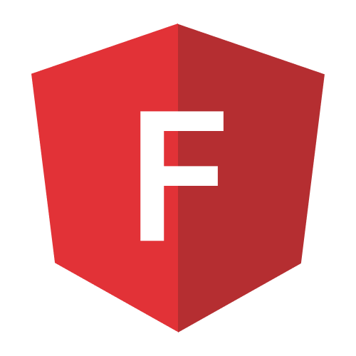

  
  <h3> 🚩 Effortless feature flag management in Angular </h3>

---

# ngx-flagr

`ngx-flagr` is an Angular library that simplifies feature flag management by providing a set of classes that can be used to efficiently manage feature flags. With `ngx-flagr`, you can easily manage feature flags, target specific users or segments, and experiment with different variations of your app's features.

## Documentation

To learn more about this library and its usage, please check out [the official documentation](https://pbouillon.github.io/ngx-flagr).

## Contributing

Contributions are warmly welcomed.

If you would like to contribute, please read the [contributing guidelines](./CONTRIBUTING.md) first.

---

This library is available on GitHub and released under the [MIT License](./LICENSE).
You can also view the [NPM packages](https://www.npmjs.com/org/ngx-flagr)  that have been published for this library.
